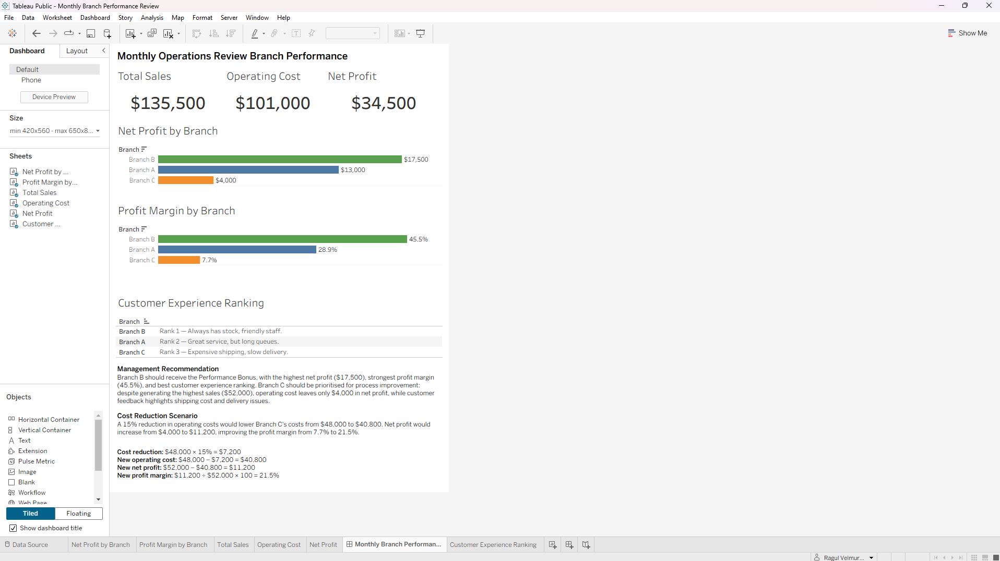

# Monthly Branch Performance Review

This project was completed as part of a Data Analyst take-home assessment. I was given financial and customer feedback data for three branches and asked to compare their performance, identify the strongest-performing branch, and recommend where operational improvements were needed.

## What I Analyzed

I looked at each branch using:

- Total Sales
- Operating Costs
- Net Profit
- Profit Margin
- Customer Feedback

I calculated Net Profit and Profit Margin because I didn't want to judge performance based only on sales. A branch can generate more revenue but still perform poorly if its operating costs are too high.

I also considered customer feedback because the financial numbers alone don't show the complete picture of how a branch is performing.

## Tools Used

- **Microsoft Excel** – data organization and calculations
- **Tableau** – dashboard development and visual comparison

## Tableau Dashboard

I built the Tableau dashboard to bring the financial results and customer feedback together in one place. It shows the overall KPIs, branch-level profitability, customer experience ranking, management recommendation, and the Branch C cost-reduction scenario.

**[View the interactive dashboard on Tableau Public](https://public.tableau.com/app/profile/ragul.velmurugan/viz/MonthlyBranchPerformanceReview/MonthlyBranchPerformanceReview?publish=yes)**

## Key Findings

| Branch | Sales | Operating Cost | Net Profit | Profit Margin |
|---|---:|---:|---:|---:|
| A | $45,000 | $32,000 | $13,000 | 28.9% |
| B | $38,500 | $21,000 | $17,500 | 45.5% |
| C | $52,000 | $48,000 | $4,000 | 7.7% |

One thing that stood out was Branch B. Even though it had the lowest sales of the three branches, it generated the highest Net Profit at **$17,500** and the highest Profit Margin at **45.5%**.

Branch C showed the opposite pattern. It generated the highest sales at **$52,000**, but its high Operating Cost of **$48,000** left only **$4,000** in Net Profit.

## Customer Experience

Based on the customer feedback provided:

1. **Branch B** – Always has stock, friendly staff.
2. **Branch A** – Great service, but long queues.
3. **Branch C** – Expensive shipping, slow delivery.

This helped me look at branch performance from both a financial and customer perspective rather than relying only on the numbers.

## Management Recommendation

### Performance Bonus – Branch B

I selected **Branch B** for the Performance Bonus because it had the highest Net Profit, strongest Profit Margin, and the best customer experience ranking.

### Process Improvement – Branch C

I identified **Branch C** as the priority for process improvement. Although it had the highest sales, its operating costs significantly reduced its profitability. The customer feedback about expensive shipping and slow delivery also points to areas where the branch could improve.

## Bonus Scenario – Branch C

I also looked at what would happen if Branch C reduced its Operating Costs by **15%** through better vendor negotiation.

**Cost reduction**

$48,000 × 15% = **$7,200**

**New Operating Cost**

$48,000 - $7,200 = **$40,800**

**New Net Profit**

$52,000 - $40,800 = **$11,200**

**New Profit Margin**

($11,200 / $52,000) × 100 = **21.5%**

With the 15% cost reduction, Branch C's Net Profit would increase from **$4,000 to $11,200**, while its Profit Margin would improve from **7.7% to 21.5%**.

## Project Files

- [Full Data Analyst Assessment](./Monthly%20Operations%20Review%201.pdf) – Written analysis, methodology, recommendations, and bonus calculation
- [Excel Analysis](./Branch_Analysis_1.xlsx) – Data and calculations
- [Dashboard Screenshot](./images/monthly-branch-performance-dashboard.png) – Static preview of the Tableau dashboard
- [Interactive Tableau Dashboard](https://public.tableau.com/app/profile/ragul.velmurugan/viz/MonthlyBranchPerformanceReview/MonthlyBranchPerformanceReview?publish=yes) – Live Tableau Public version

## Author

**Ragul Velmurugan**
